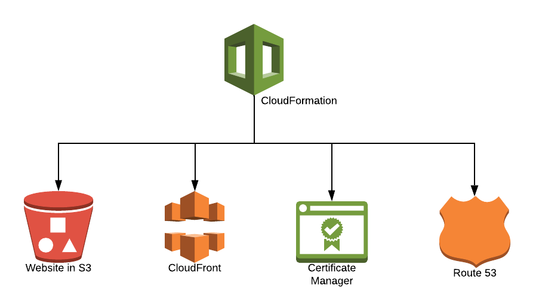

# Launch Your Website using AWS in Minutes 
## … and leave any server and infrastructure complications behind

## Table of Contents

- [Introduction](https://github.com/formkiq/parima#introduction)
- [How It Works](https://github.com/formkiq/parima#how-it-works)
- [Installation](https://github.com/formkiq/parima#installation)
- [Frequently Asked Questions](https://github.com/formkiq/parima#frequently-asked-questions)

# Introduction

## What is Parima?

Parima is a free, open source project that has been created to allow easy publishing of static web sites and JavaScript web applications (like Angular or React apps) using Amazon Web Services. It's ideal for designers and front-end developers who want to launch a new web site without having to worry about hosting outside of creating an AWS Account.

Parima creates a simple, serverless architecture for your web site, using Amazon S3 to store the markup, code, and asset files, and AWS CloudFront to distribute the site using HTTPS. It can be installed with or without a custom domain (for custom domain requires domain DNS to be using Route53).

## Requirements

* **An Amazon Web Services (AWS) Account:** Parima requires you to have your own Amazon Web Services Virtual Private Cloud. AWS provides a generous [Free Tier](https://aws.amazon.com/free) that includes all of the products used by Parima (aside from adding an optional custom domain in Route 53).

    It is a good idea to have an [AWS Budget](https://console.aws.amazon.com/billing/home?#/budgets) with an alert set up before using AWS, to prevent any unexpected costs. (For personal and/or low-traffic sites, you should be able to keep costs well below $5 a month, so you could use that for the budget amount unless you expect an unusually large amount of traffic.)

    **[Sign Up for an AWS Account](https://portal.aws.amazon.com/billing/signup)**

* **[AWS Command Line Interface](https://aws.amazon.com/cli/)** is a tool provided by AWS to manage your AWS services. Using the AWS CLI, make it easy to deploy Parima and to sync your local website with AWS.

# How It Works

Parima installs into your AWS Account using CloudFormation (through the Console or AWS CLI).

CloudFormation sets up an S3 bucket to hold the artifacts of the website, as well as CloudFront to host the website in Amazon's content delivery network (CDN). Optionally, if a Domain/Hosted Zone is specified, a Certificate and Route 53 DNS entries are created for your custom domain.

    
# Installation

**NOTE:** It may take up to **15 minutes** for the CloudFormation script to complete.

## CloudFormation Parameters

### WebsiteVersion
Parima is set up to handle multiple versions of a website and easily switch between them. This CloudFormation parameter control which version of the website is active. By default a **v1** version is created. This means that you need to upload all your website contents to the **v1** directory inside of S3. 

Creating a **v2** version of your website is very easy. Upload your website contents to a **v2** directory and then run the CloudFormation script and specify **v2** in the **WebsiteVersion** parameter. This will tell CloudFront to serve files in the **v2** directory. If you want to switch baack to **v1**, just run the CloudFormation again and specify **v1** as the **WebsiteVersion**. Running CloudFormation to update will not overwrite any of your existing files.

### HostedZone & DomainName (Optional)
By default, CloudFront generates a random URL to access your website, such as https://*abcdefg99*.cloudfront.net.

You can specify a custom domain/Route 53 hosted zone during the installation of Parima, and that domain will be used for the website, e.g. www.mycompany.com.

**Note:** The domain needs to have a Route 53 Hosted Zone. e.g. Route 53 Hosted Zone mycompany.com must exist and the DNS must point to the Amazon Web Services' DNS.

A domain registered outside of AWS can be used (by setting up an Amazon Route 53 [Hosted Zone](https://console.aws.amazon.com/route53/v2/hostedzones#) and supplying the Nameserver entries that will be generated by Route 53 to your Domain Registrar), or a new domain can be registered within the AWS Management Console.

**[Register a Domain using Amazon Route 53](https://console.aws.amazon.com/route53/home#DomainRegistration:)** | **[Transfer a Domain to Amazon Route 53](https://console.aws.amazon.com/route53/home#DomainTransfer:)**

## CloudFormation Outputs

The Parima CloudFormation generates the following outputs:
* WebsiteUrl - The Website URL
* AccessKeyId / AccessKeySecret - IAM Security credentials
* SyncCommand - The aws cli command that can be used to sync the website in the current directory with AWS
* S3Bucket - The location of the hosted website files

## AWS Console

Using the links below to install Parima with one click.
|Region|CloudFormation Url|
|--------------|--------------------------|
| us-east-1 |  https://us-east-1.console.aws.amazon.com/cloudformation/home?region=us-east-1#/stacks/create/review?templateURL=https://formkiq-distribution-core.s3.amazonaws.com/parima/v1.0/parima.yml&stackName=parima |
| us-east-2 |  https://us-east-2.console.aws.amazon.com/cloudformation/home?region=us-east-2#/stacks/create/review?templateURL=https://formkiq-distribution-core.s3.amazonaws.com/parima/v1.0/parima.yml&stackName=parima |
| us-west-1 |  https://us-west-1.console.aws.amazon.com/cloudformation/home?region=us-west-1#/stacks/create/review?templateURL=https://formkiq-distribution-core.s3.amazonaws.com/parima/v1.0/parima.yml&stackName=parima |
| us-west-2 |  https://us-west-2.console.aws.amazon.com/cloudformation/home?region=us-west-2#/stacks/create/review?templateURL=https://formkiq-distribution-core.s3.amazonaws.com/parima/v1.0/parima.yml&stackName=parima |
| af-south-1 |  https://af-south-1.console.aws.amazon.com/cloudformation/home?region=af-south-1#/stacks/create/review?templateURL=https://formkiq-distribution-core.s3.amazonaws.com/parima/v1.0/parima.yml&stackName=parima |
| ap-east-1 |  https://ap-east-1.console.aws.amazon.com/cloudformation/home?region=ap-east-1#/stacks/create/review?templateURL=https://formkiq-distribution-core.s3.amazonaws.com/parima/v1.0/parima.yml&stackName=parima |
| ap-northeast-1 |  https://ap-northeast-1.console.aws.amazon.com/cloudformation/home?region=ap-northeast-1#/stacks/create/review?templateURL=https://formkiq-distribution-core.s3.amazonaws.com/parima/v1.0/parima.yml&stackName=parima |
| ap-northeast-2 |  https://ap-northeast-2.console.aws.amazon.com/cloudformation/home?region=ap-northeast-2#/stacks/create/review?templateURL=https://formkiq-distribution-core.s3.amazonaws.com/parima/v1.0/parima.yml&stackName=parima |
| ap-northeast-3 |  https://ap-northeast-3.console.aws.amazon.com/cloudformation/home?region=ap-northeast-3#/stacks/create/review?templateURL=https://formkiq-distribution-core.s3.amazonaws.com/parima/v1.0/parima.yml&stackName=parima |
| ap-south-1 |  https://ap-south-1.console.aws.amazon.com/cloudformation/home?region=ap-south-1#/stacks/create/review?templateURL=https://formkiq-distribution-core.s3.amazonaws.com/parima/v1.0/parima.yml&stackName=parima |
| ap-southeast-1 |  https://ap-southeast-1.console.aws.amazon.com/cloudformation/home?region=ap-southeast-1#/stacks/create/review?templateURL=https://formkiq-distribution-core.s3.amazonaws.com/parima/v1.0/parima.yml&stackName=parima |
| ap-southeast-2 |  https://ap-southeast-2.console.aws.amazon.com/cloudformation/home?region=ap-southeast-2#/stacks/create/review?templateURL=https://formkiq-distribution-core.s3.amazonaws.com/parima/v1.0/parima.yml&stackName=parima |
| ca-central-1 |  https://ca-central-1.console.aws.amazon.com/cloudformation/home?region=ca-central-1#/stacks/create/review?templateURL=https://formkiq-distribution-core.s3.amazonaws.com/parima/v1.0/parima.yml&stackName=parima |
| eu-central-1 |  https://eu-central-1.console.aws.amazon.com/cloudformation/home?region=eu-central-1#/stacks/create/review?templateURL=https://formkiq-distribution-core.s3.amazonaws.com/parima/v1.0/parima.yml&stackName=parima |
| eu-north-1 |  https://eu-north-1.console.aws.amazon.com/cloudformation/home?region=eu-north-1#/stacks/create/review?templateURL=https://formkiq-distribution-core.s3.amazonaws.com/parima/v1.0/parima.yml&stackName=parima |
| eu-south-1 |  https://eu-south-1.console.aws.amazon.com/cloudformation/home?region=eu-south-1#/stacks/create/review?templateURL=https://formkiq-distribution-core.s3.amazonaws.com/parima/v1.0/parima.yml&stackName=parima |
| eu-west-1 |  https://eu-west-1.console.aws.amazon.com/cloudformation/home?region=eu-west-1#/stacks/create/review?templateURL=https://formkiq-distribution-core.s3.amazonaws.com/parima/v1.0/parima.yml&stackName=parima |
| eu-west-2 |  https://eu-west-2.console.aws.amazon.com/cloudformation/home?region=eu-west-2#/stacks/create/review?templateURL=https://formkiq-distribution-core.s3.amazonaws.com/parima/v1.0/parima.yml&stackName=parima |
| eu-west-3 |  https://eu-west-3.console.aws.amazon.com/cloudformation/home?region=eu-west-3#/stacks/create/review?templateURL=https://formkiq-distribution-core.s3.amazonaws.com/parima/v1.0/parima.yml&stackName=parima |
| me-south-1 |  https://me-south-1.console.aws.amazon.com/cloudformation/home?region=me-south-1#/stacks/create/review?templateURL=https://formkiq-distribution-core.s3.amazonaws.com/parima/v1.0/parima.yml&stackName=parima |
| sa-east-1 |  https://sa-east-1.console.aws.amazon.com/cloudformation/home?region=sa-east-1#/stacks/create/review?templateURL=https://formkiq-distribution-core.s3.amazonaws.com/parima/v1.0/parima.yml&stackName=parima |

## Using AWS CLI 
Assumes you have the AWS CLI [configured](https://docs.aws.amazon.com/cli/latest/userguide/cli-chap-configure.html).

* **Clone Repo:** git clone https://github.com/formkiq/parima.git
* **Run Installation With Custom Domain:** aws cloudformation deploy --template-file parima.yml --stack-name &lt;stack_name&gt; --parameter-overrides HostedZone=&lt;hosted_zone_name&gt; DomainName=&lt;domain_name&gt; --capabilities CAPABILITY_IAM  --region &lt;aws_region&gt;
* **Run Installation Without Custom Domain:** aws cloudformation deploy --template-file parima.yml --stack-name &lt;stack_name&gt; --capabilities CAPABILITY_IAM --region &lt;aws_region&gt;
* **CloudFormation Results:** aws cloudformation describe-stacks --stack-name &lt;stack_name&gt; --region &lt;aws_region&gt;

The CloudFormation output will display:
* The StackStatus will indicate if the CloudFormation template was successful or not.
* The CloudFront URL used to access the website.
* The AccessKey/Secret that have read/write access to update the website.
* The aws cli "sync" command that can be used to sync the current directory to the s3 bucket.
<pre>
{
    "Stacks": [
        {
            "StackName": "&lt;stack_name&gt;",
            ...
            "StackStatus": "CREATE_COMPLETE",
            ...
            "Outputs": [
                {
                    "OutputKey": "S3Bucket",
                    "OutputValue": "parima-s3bucket-XXXXXXXXXX",
                    "Description": "S3 Bucket"
                },
                {
                    "OutputKey": "AccessKeyId",
                    "OutputValue": "AKIAZB6IXXXXXX",
                    "Description": "S3 Access Key"
                },
                {
                    "OutputKey": "AccessKeySecret",
                    "OutputValue": "TaVIVcYXXXXXXXXXXXXXXX",
                    "Description": "S3 Secret Key"
                },                
                {
                    "OutputKey": "SyncCommand",
                    "OutputValue": "aws s3 sync . s3://parima-s3bucket-XXXXXXXXX/v1",
                    "Description": "Sync Current Directory to S3"
                },
                {
                    "OutputKey": "WebsiteUrl",
                    "OutputValue": "https://d2nXXXXXXXXX.cloudfront.net",
                    "Description": "Website Url"
                }
            ]
        }
    ]
}
</pre>

## Bugs and Feedback

For bugs, questions and discussions please use the [GitHub Issues](https://github.com/formkiq/parima/issues).

 
## LICENSE

Copyright 2020 FormKiQ, Inc.

Licensed under the Apache License, Version 2.0 (the "License");
you may not use this file except in compliance with the License.
You may obtain a copy of the License at:

<http://www.apache.org/licenses/LICENSE-2.0>

Unless required by applicable law or agreed to in writing, software
distributed under the License is distributed on an "AS IS" BASIS,
WITHOUT WARRANTIES OR CONDITIONS OF ANY KIND, either express or implied.
See the License for the specific language governing permissions and
limitations under the License.

# Frequently Asked Questions

### **1. Why not simply use S3 and CloudFront?**

Parima is a framework to help you set up S3 and CloudFront with one-click, and also includes Custom Domains as part of that simple process.

### **2. How much does hosting a Parima-launched site cost?**

As Parima is free to use, the total cost would be based only on AWS usage and Amazon Route53 DNS. We estimate that most low-to-medium traffic static sites could be run for USD$1.50-4.00 per month.

### **3. If I make changes to my website and redeploy (using AWS CLI Sync), what happens to my previous site and the files stores in S3?**

Parima will NEVER delete any S3 resources; the S3 DeletionPolicy is set to "Retain", so even deleting the CloudFormation Stack, the content inside your S3 Bucket will remain. Updating your content through Sync will update files within S3, but previous versions can be preserved by turning on S3 Versioning for your bucket.

You can also choose to create a new version of your website by re-running CloudFormation with a new WebsiteVersion parameter. For example, changing from V1 to V2 will create a new copy of your website in a new V2 folder, and will point your CloudFront URL or Custom Domain URL to that V2 version. Your V1 version would be available as an archived version, and you can then revert to that V1 version of your site at any point by re-running CloudFormation with V1 as your WebsiteVersion parameter.

### **4. How do I create multiple environments, like Development and Production?**

You can create as many environments as you like, and can either create subdomains for other environments, e.g., dev.mydomain.com, or use the automatic CloudFront URLs, e.g., https://*abcdefg99*.cloudfront.net

### **5. What’s the advantage of this vs using a static site Terraform module or any other Cloud Formation template?**

The main advantage is simplicity. You can have a static site with a custom domain setup in less than 5 minutes.
    
All other CloudFormation templates have two problems:
    * You only can deploy them in us-east-1 because CloudFront requires certificates to be created there. Parima can be run in any region.
    * CloudFormation cannot validate a certificate automatically. You either need to do it manually or run a custom script.

Terraform modules have similar issues.

### **6. What sets Parima apart from the AWS Amplify command "amplify add hosting"?**

The idea we are going for with Parima is to provide a simpler process than Amplify, one that only creates the resources required for static site / spa framework hosting.

It's also one-click, so is well-suited to devs who aren't looking to learn the feature set of Amplify at this point.

### **7. Why does Parima not include any back end functionality?**

Parima is focused on launching static sites and JavaScript frameworks such as Angular, React, and Vue. However, we are looking into adding optional back-end features, such as handling web forms.

For developers who are interested in adding a back-end API of their own for their Parima-launched site to consume, Amazon provides an excellent tool, [AWS SAM CLI](https://github.com/aws/aws-sam-cli).
    
We are looking at creating Tutorials to help developers use Parima along with an API created with SAM CLI, but for now, you can find more information in the [AWS Serverless Application Model Developer Guide](https://docs.aws.amazon.com/serverless-application-model/latest/developerguide/what-is-sam.html).